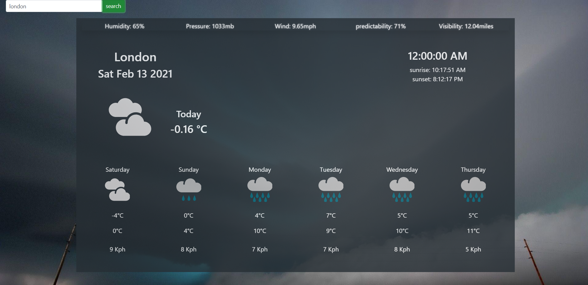
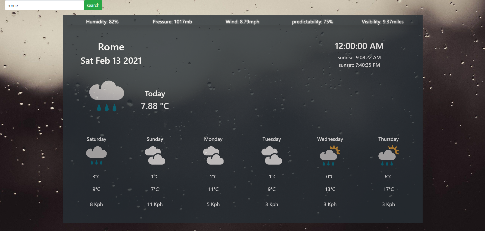

 #Weather Forecast App
 ☀️🌤⛅️🌥🌦

The best weather app you will ever see ! now you can know every single detail about the weather before your picnic we will even tell you about
the wind speed 🌬 in your location.

## OverView

through our simple UI you can see the weather in your location and in every single place in the world by a click of a button   

   

you can see the weather forecast for the entire week detaling every important information in simple way.   

   

for every single weather status you will see a nice background that describe how the weather is   

   

## Live Demo
View the [live demo](https://)!

## Site Map

- the first thing you will see when you open the site is the search bar on the top left. here you can choose the city you want to see it's weather. 
- after the search there is the status bar which gives you a brief of important weather information.   
- then we have the city, weather forecast and time.   

- the last thing is the weekly forecast of the weather   

## How to use

1-open the application link  
2-you will see a default city. search for your city. 
3-you will see today's weather for your city navigate down to see weekly forecast. 

### Built With
- [React ](https://reactjs.org/)- A JavaScript library for building user interfaces

### Dependencies

- Node: [http://nodejs.org/](http://nodejs.org/)
- React-Bootstrap: [https://react-bootstrap.github.io/](https://react-bootstrap.github.io/)
- Axios: [https://www.npmjs.com/package/react-axios/](https://www.npmjs.com/package/react-axios/)
- ReactJS: [https://reactjs.org](https://reactjs.org)

### Contributors

This app is developed by c++ Team

### Initial Set Up

1. Clone the repository
2. `npm install` or `yarn`
3. `npm start` or `yarn start` app start with your port number
-------------------------------------------------------------------

